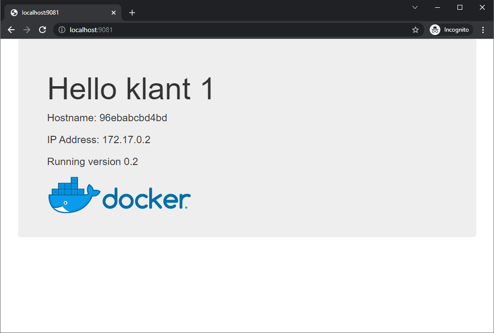
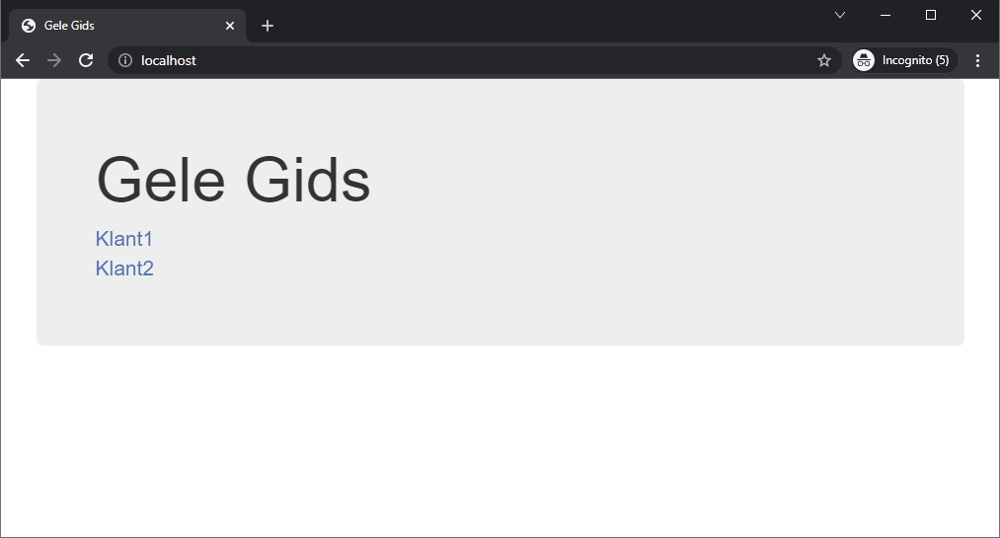
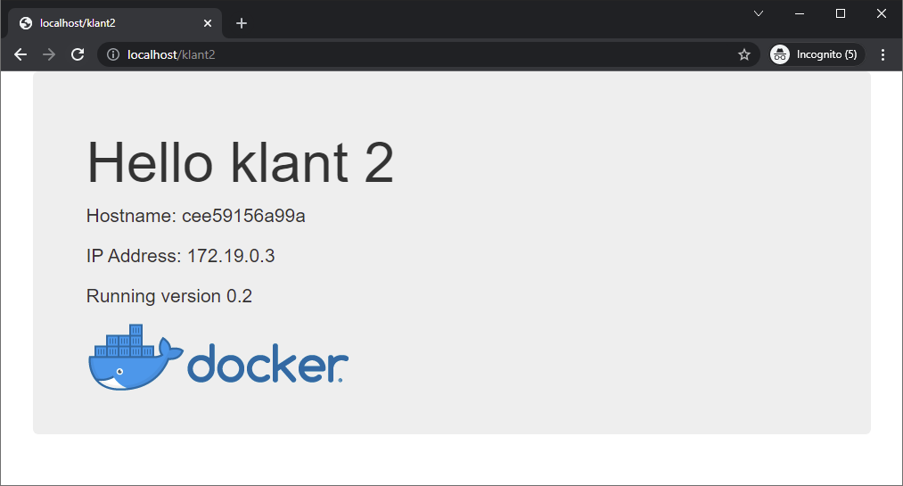

# Jorny

Er zijn 2 folders, voor klant1 en voor klant2. Elk van die folders heeft een `Dockerfile`.

Build and run containers voor klant 1 en klant 2.

```powershell
docker build -t klant1:v0.1 ./klant1
docker build -t klant2:v0.1 ./klant2
```

Er zijn 2 images gebouwd.


We starten de images

```powershell
docker run -d -p 9081:80 -name klant1 klant1:v0.1
docker run -d -p 9082:80 -name klant2 klant2:v0.1
```

Er zijn 2 containers gestart. De poorten zijn 9081 en 9082 voor de respectievelijke klanten.


De containers draaien op hun poorten 9081 en 9082.




We willen een systeem om gemakkelijk van de ene klant naar de andere te gaan zonder de poorten te moeten onthouden

## Optie 1 - GitHub - Easy

Hou de urls gewoon bij in een GitHub pagina:

- [klant1](http://localhost:9081)
- [klant2](http://localhost:9082)

De GitHub staat centraal en vereist geen extra hosting.

## Optie 2 - Reverse proxy - Ook easy

We hadden het erover om de urls op een Apache static webpage te hosten, maar dan vind ik optie 1 eleganter. Voor static pages hebben we geen extra container nodig. 
Maar we kunnen wel mooiere dingen doen met een reverse proxy. We kunnen ervoor zorgen dat `http://localhost/klant1` geredirect wordt naar `http://localhost:9081`. Eigenlijk hebben we geen portforward meer nodig. We zorgen ervoor dat `http://localhost/klant1` gewoon de pagina's toont van de juiste container.

Dus deze zijn voldoende

```powershell
docker run -d -name klant1 klant1:v0.1
docker run -d -name klant2 klant2:v0.1
```

We maken een docker network (omdat we de containers by name willen aanspreken)

```powershell
docker network create devnet
```

Er is 1 netwerk bijgemaakt.


We kunnen de containers verbinden met het nieuwe netwerk - devnet.

```powershell
docker network connect devnet klant1
docker network connect devnet klant2
docker network inspect devnet
```

We zien bij inspect dat de containers verbonden zijn.


We voegen een niewe container toe, de reverseproxy, een Nginx.

```powershell
docker run -d -p 80:80 --name rp --network devnet -v d:\jorny\nginx:/etc/nginx/conf.d/ -v d:\jorny\www:/etc/nginx/html/ nginx:stable
```

Dat is een mondje vol:

```powershell
docker run                                \ # we runnen docker
  -d                                      \ # dettached
  -p 80:80                                \ # port forward voor poort 80 op de host naar 80 op de container
  --name rp                               \ # naam van de container is rp
  --network devnet                        \ # we koppelen meteen aan het devnet netwerk
  -v d:\jorny\nginx:/etc/nginx/conf.d/    \ # we koppelen het volume d:\jorny\nginx op de host aan /etc/nginx/conf.d/
  -v d:\jorny\www:/etc/nginx/html/        \ # we koppelen het volume d:\jorny\www op de host aan /etc/nginx/html/
```

De folder `nginx` bevat een bestand `default.conf` met de configuratie van de reverse proxy

```bash
server {
    location /klant1 {
        proxy_pass             http://klant1/;
    }
    location /klant2 {
        proxy_pass             http://klant2/;
    }
}
```

En voor de volledigheid heb ik ook de default webpagina van Nginx ook wat aangepast. Als je dan surft naar [http://localhost](http://localhost) dan zie je toch ook iets.

```html
<!doctype html>
<html lang="en">
<head>
  <title>Gele Gids</title>
  <meta charset="UTF-8">
  <link rel="stylesheet" href="https://stackpath.bootstrapcdn.com/bootstrap/3.4.1/css/bootstrap.min.css" integrity="sha384-HSMxcRTRxnN+Bdg0JdbxYKrThecOKuH5zCYotlSAcp1+c8xmyTe9GYg1l9a69psu" crossorigin="anonymous">
</head>
<body class="container">
    <div class="jumbotron">
      <h1>Gele Gids</h1>
        <p>
          <a href="http://localhost/klant1">Klant1</a><br>
          <a href="http://localhost/klant2">Klant2</a><br>
        </p>
    </div>
</body>
</html>
```

Als je aanpassingen maakt in de files dan moet je de Nginx deamon even herstarten. Het gemakkelijkste is de container even verwijderen en opnieuw starten.

```powershell
# Container stoppen en verwijderen
docker container rm rp -f

# Container starten
docker run -d -p 80:80 --name rp --network devnet -v d:\jorny\nginx:/etc/nginx/conf.d/ -v d:\jorny\www:/etc/nginx/html/ nginx:stable
```

De landingspagina ziet er dan zo uit



De pagina van klant 1 - merk op: **geen portforward meer**


De pagina van klant 2 - merk op: **geen portforward meer**


